# 🚀 Getting Started with Ringularity

<p align="center">
  
</p>

This guide walks you through everything you need to get the Ringularity app running — from setting up the development environment to pairing your smart ring for the first time.

---

## 📋 Prerequisites

Before you begin, make sure you have the following installed:

| Tool | Version | Notes |
|---|---|---|
| [Flutter SDK](https://docs.flutter.dev/get-started/install) | ≥ 3.x | Required for the mobile app |
| [Dart SDK](https://dart.dev/get-dart) | ^3.9.2 | Bundled with Flutter |
| [Android Studio](https://developer.android.com/studio) / [Xcode](https://developer.apple.com/xcode/) | Latest | Required for Android/iOS **platform SDKs** |
| IDE (e.g. [VS Code](https://code.visualstudio.com/) + [Flutter extension](https://marketplace.visualstudio.com/items?itemName=Dart-Code.flutter), or Android Studio) | Any | Your choice of editor |
| [Ruby](https://www.ruby-lang.org/) | ≥ 3.x | Required to run the backend locally |
| [PostgreSQL](https://www.postgresql.org/) | ≥ 14 | Required for the backend database |
| [Docker](https://www.docker.com/) | Latest | Alternative to local backend setup |

> **Note:** A physical device is strongly recommended for BLE (Bluetooth) testing. Most BLE features do not work on emulators.

---

## 📁 Project Structure

```
Ringularity/
├── README.md
├── GETTING_STARTED.md       ← You are here
└── ringularity/
    ├── lib/                 ← Flutter app source code
    │   ├── main.dart
    │   ├── screens/         ← UI screens (auth, home, details, activity)
    │   ├── services/        ← Business logic (BLE, API, health, user)
    │   ├── widgets/         ← Reusable UI components
    │   ├── models/          ← Data models
    │   └── theme/           ← Colors, text styles
    ├── android/             ← Android platform files
    ├── ios/                 ← iOS platform files
    ├── assets/              ← Images, fonts, etc.
    ├── pubspec.yaml         ← Flutter dependencies
    └── backend/             ← Ruby on Rails API
```

---

## 🛠 Part 1: Setting Up the Flutter App

### Step 1 — Clone the Repository

```bash
git clone <repository-url>
cd Ringularity/ringularity
```

### Step 2 — Install Flutter Dependencies

```bash
flutter pub get
```

### Step 3 — Configure the API Endpoint

The app communicates with the Ringularity backend. You need to point it to your backend instance (local or production).

Open `lib/services/api/api_service.dart` and update the base URL:

```dart
// Example for local development:
static const String baseUrl = 'http://[IP_ADDRESS]';
```

### Step 4 — Platform Permissions

#### Android
The required permissions are already declared in `android/app/src/main/AndroidManifest.xml`. No extra steps needed.

#### iOS
Ensure the following keys are present in `ios/Runner/Info.plist`:
- `NSBluetoothAlwaysUsageDescription`
- `NSLocationWhenInUseUsageDescription`

These are already included in the project.

### Step 5 — Run the App

Connect a **physical device** via USB (recommended), then run:

```bash
flutter run
```

To run on a specific device:

```bash
flutter devices          # List available devices
flutter run -d <device-id>
```

---

## 🗄 Part 2: Setting Up the Backend

For full instructions on running the backend locally or via Docker, see the **[Backend README](ringularity/backend/README.md)**.

---

## 💍 Part 3: Connecting Your Smart Ring

The app supports **Colmi-compatible smart rings**, including:

- **Colmi R02, R06, R10, R12**
- Any ring advertising itself as "Ring", "Yawell", or "Colmi"

### Step 1 — Enable Bluetooth on Your Phone

Make sure Bluetooth is **enabled** on your phone before opening the app. On Android, also ensure **Location** is enabled (required for BLE scanning by the OS).

### Step 2 — Register or Log In

1. Launch the app on your device.
2. On the welcome screen, tap **Register** to create a new account, or **Login** if you already have one.

   > **Offline mode:** If the backend is unreachable, you'll see an "You are offline!" notice. Login/Register requires an active internet connection.

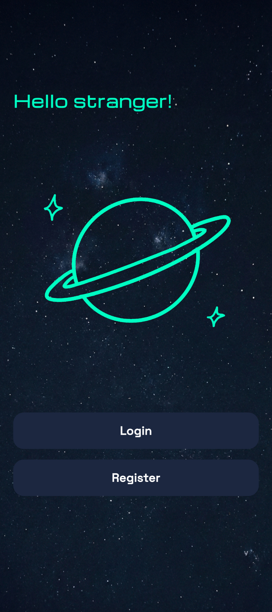

### Step 3 — Navigate to Settings

1. After logging in, you'll land on the **Dashboard**.
2. Tap the **Settings** icon (the gear icon in the navigation bar).

### Step 4 — Pair Your Ring

1. In the **Device Management** section, tap **"Connect Device"**.
2. The app will automatically begin scanning for nearby compatible rings.
3. Your ring should appear in the list within a few seconds. If it doesn't:
   - Make sure the ring is charged and powered on.
   - Try wearing the ring to ensure the sensors are active.
   - Move the ring closer to your phone.
4. Tap on your ring in the list to initiate the connection.
5. The app will **bind** to the ring — this is a one-time pairing step that registers the device.

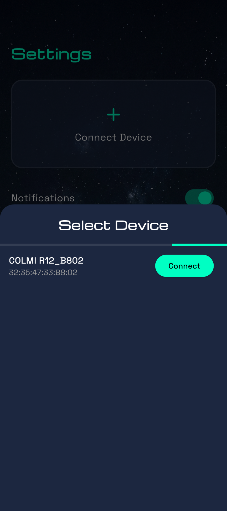

### Step 5 — Verify Connection

Once connected, the device card in Settings will display the ring's **name** and **battery level**. The dashboard will begin showing live data shortly after.

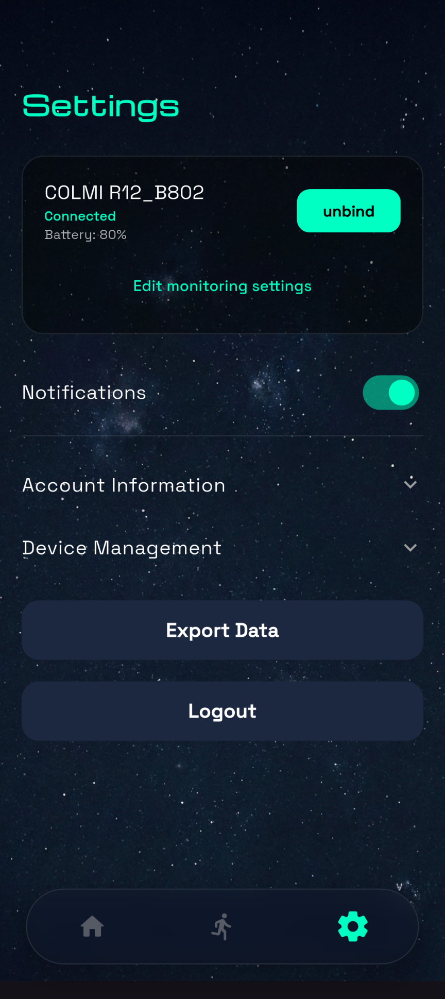

### Auto-Reconnect

Once paired, the ring will **automatically reconnect** the next time you open the app, as long as Bluetooth is enabled. You do not need to re-pair each time.

---

## 🔄 Data Sync

After connecting, Ringularity will automatically:

- **Sync historical data** from the ring (HR, HRV, Stress, Steps, Sleep) on app launch.
- **Upload synced data** to the backend for cloud storage and cross-device access.
- **Poll for new data** in the background while the app is in use.

You can also trigger a manual sync from the Dashboard by pulling down on the screen.

---

## 📱 Part 4: Using the App

Once the ring is connected and synced, here's a quick tour of the main sections of the app.

### 🏠 Dashboard

The dashboard is your starting point. It shows your current vitals at a glance — heart rate, HRV, and stress — along with your activity rings for the day.

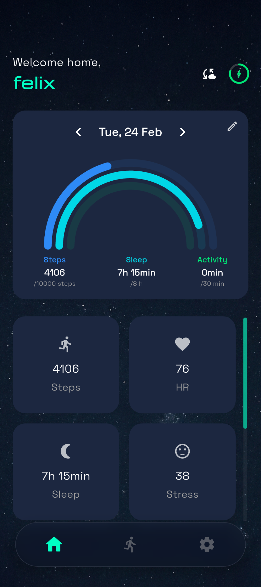

---

### 💓 Heart Rate Graph

Tap the HR tile on the dashboard to open the Heart Rate history view. You can browse daily, weekly, and monthly HR trends with an interactive graph.

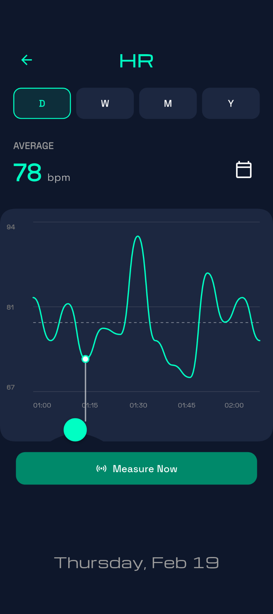

---

### 📅 Month Overview

This view shows the steps, sleep and activity rings for the current month. You can tap on each day to see the detailed data for that day.

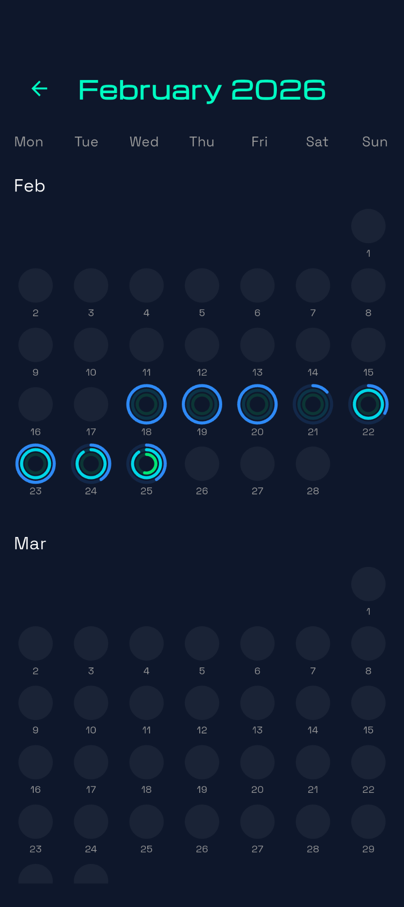

---

### 🧠 Stress Graph

The Stress tile shows your stress level throughout the day, derived from HRV analysis performed by the ring. View historical stress patterns in the detail screen.

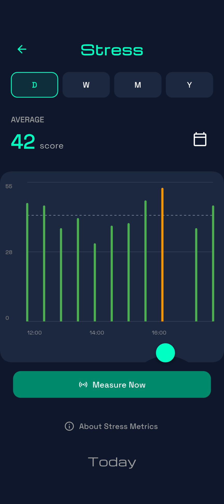

---

### 💤 Sleep Graph

The Sleep section gives you a breakdown of your night: light sleep, deep sleep, REM sleep and awake periods, visualised as a timeline. Tap a previous day to see historic sleep data.

<table><tr>
  <td>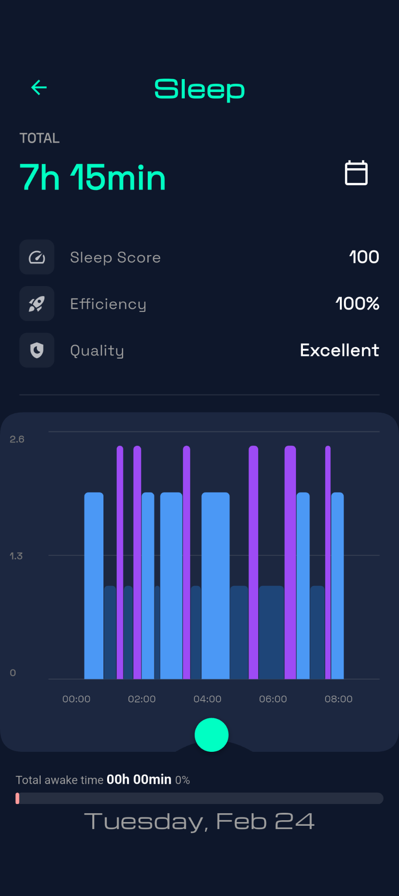</td>
  <td>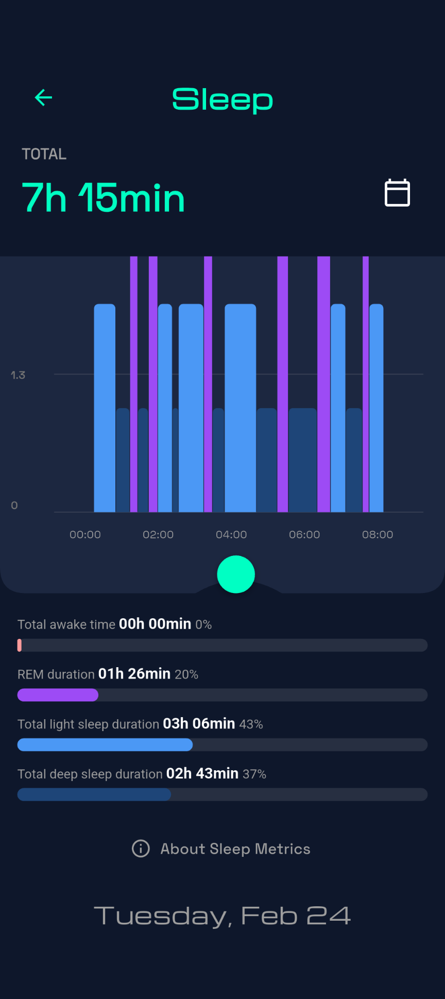</td>
</tr></table>

---

### 🏃 Activity & Steps

The Activity section tracks your step count and active time for the day. The activity rings on the dashboard fill up as you hit your daily targets.

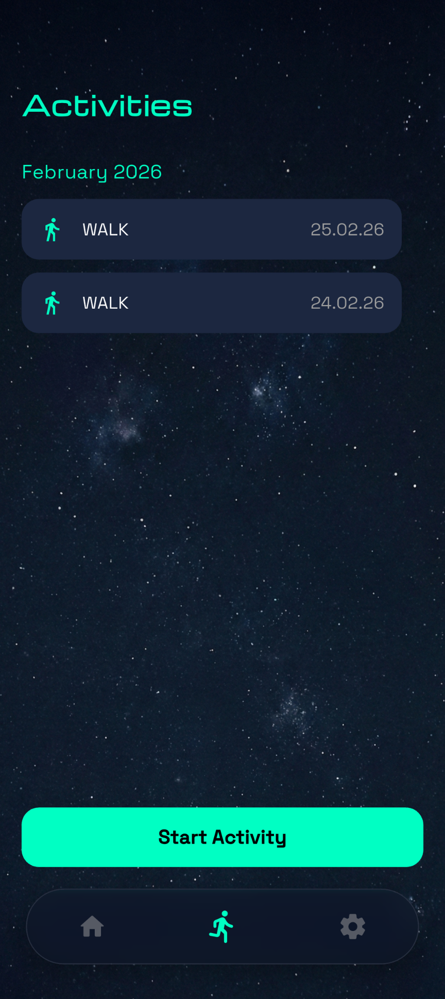

---

### 🎯 Weekly Goals

Tap the activity rings card to open your **Weekly Goals**. Here you can set custom targets for steps and walking/running, and track your weekly progress across days.

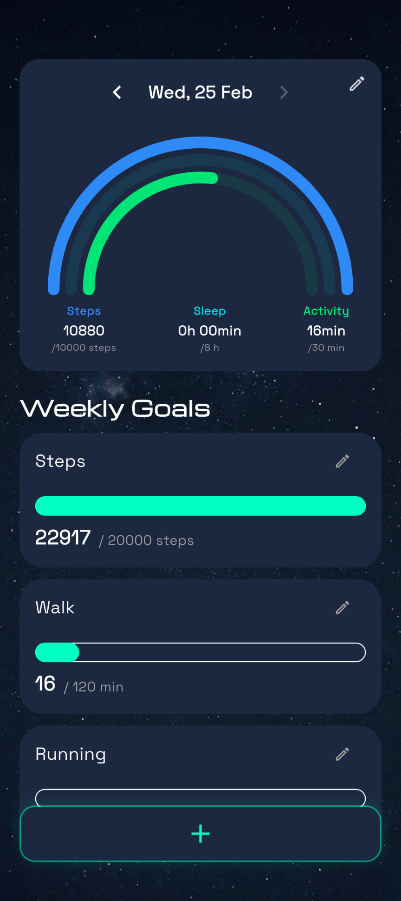

---

## 🐛 Troubleshooting

### The app gets stuck on the loading/splash screen
- Check that the backend is running and reachable.
- Verify the API URL in `api_service.dart` is correct.
- The app will time out and switch to offline mode after a few seconds if the backend is unreachable.

### My ring doesn't appear during scanning
- Ensure Bluetooth and Location are both enabled on your phone.
- Confirm the ring name matches one of the supported devices: `R02`, `R06`, `R10`, `R12`, `Ring`, `Yawell`, `Colmi`.
- Try restarting both the ring and the app.

### Data isn't syncing
- Check the connection status indicator on the Settings screen.
- Make sure the backend server is running and the app's base URL is correct.
- Ensure the ring stays close to your phone during an initial full sync.

### Build errors after `flutter pub get`
- Run `flutter clean` and then `flutter pub get` again.
- Make sure your Flutter SDK is up to date: `flutter upgrade`.

---

## 📚 Further Reading

- [Backend README](ringularity/backend/README.md)
